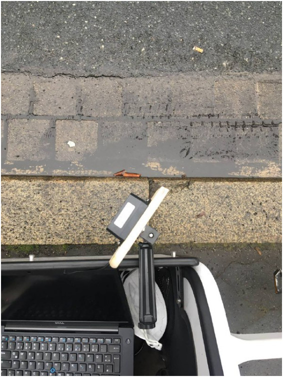
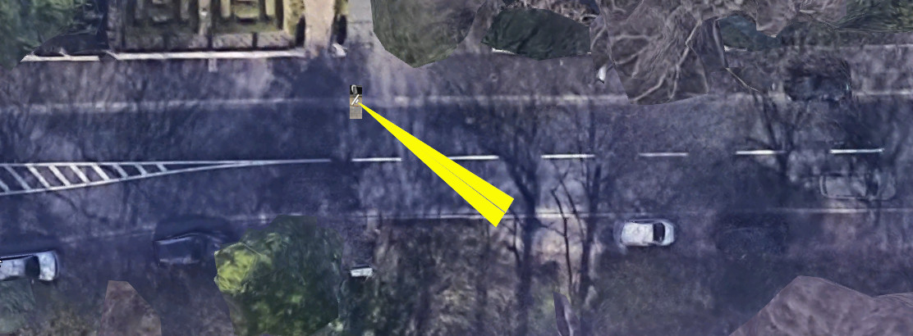
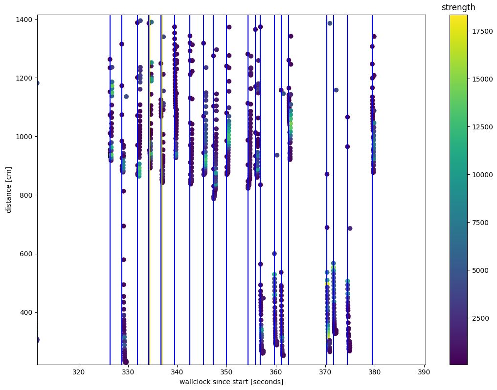
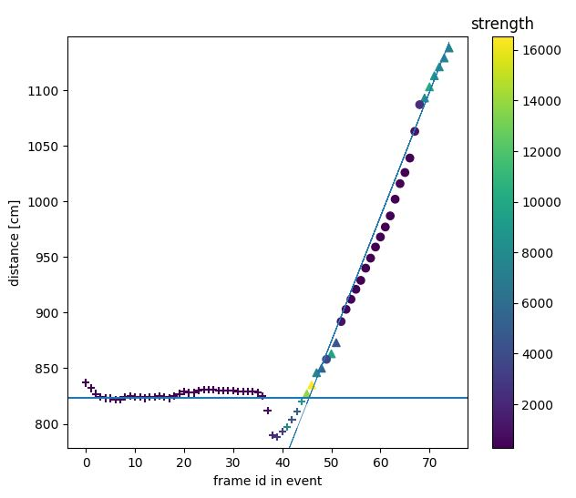

## Lidar traffic counting and speed profiling in the horizontal plane

This software evaluates counting traffic and measure speed in the horizontal plane, 
using a Benewake TF02-pro lidar. The lidar has a nominal range of 45m with ideal reflektors.

_Lidar from the top, mounted with a tripod socket._

The lidar can be connected to a laptop using a TTL-USB converter i.e. CH340. Alternatively e.g. a Raspberry Pi can be used 
for data collection on its UART port.

In the height of around 70cm over ground the lidar was found getting good reflection from cars up to around 15m.
Measuring one lane is perfectly possible, two lanes also work fine. More lanes might work for pure counting without also
reading speed. Also, vehicles overlapping each other get a more significant issue.

_Direction of measurement for a good reading up to around 15m at h=70cm. Image source Google Maps._

The software is split into two pieces. A datacollector.py which reads the lidar output into a file and a dataplotter.py 
which processes the file an evaluates speed. In the datacollector you might need to configure the voidDistance which is returned
in case no car is present (if there is no reflecting object on the other side of the street the lidar returns 45m if no
reflection is found).

The dataplotter gives an overview plot you can interactively zoom into (pycharm professional users might need to switch of 
scientific plotting)

_Zoom into overview plot. One can clearly see the two lanes of the road._

The current version of the software can evaluate clearly identified single events of passing cars. Overlapping cars or 
traffic jam situations can't be evaluated.
The single event is passed to an Event class which also allows to plot the evaluation for debugging purposes.

The basic algorithm has the following steps:
* Eliminate the first 5 and the last 2 readings as the lidar needs some readings to return proper values and might 
  return some artifacts at the end.
* Guess the direction of the car (TOWARDS or AWAY)
* Eliminate the side reflection of the passing car
* Select the 40% of the points with the best strength of reflection
* Do a linear interpolation to evaluate the speed

The debug plot shows the side reflection as + and the selected points for interpolation as ^

_Debug plot of a car coming towards the sensor. Side reflection as + the top 40% points as ^. The line showing 
the result of the linear interpolation_

_Debug plot of a car going away from the sensor._

